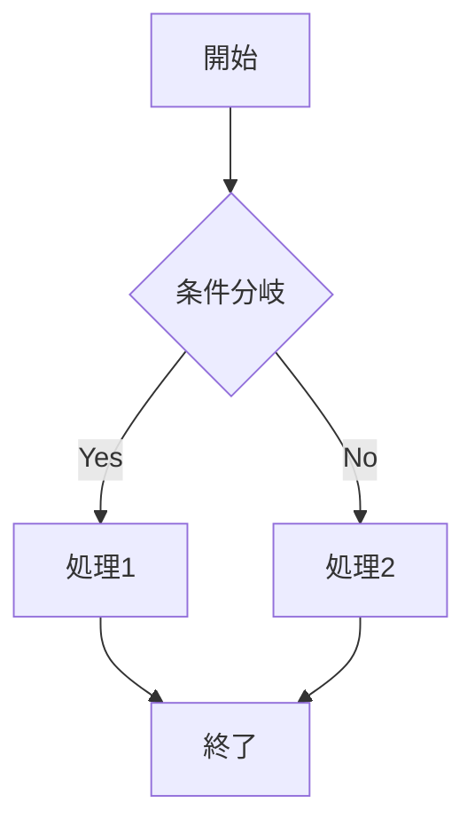
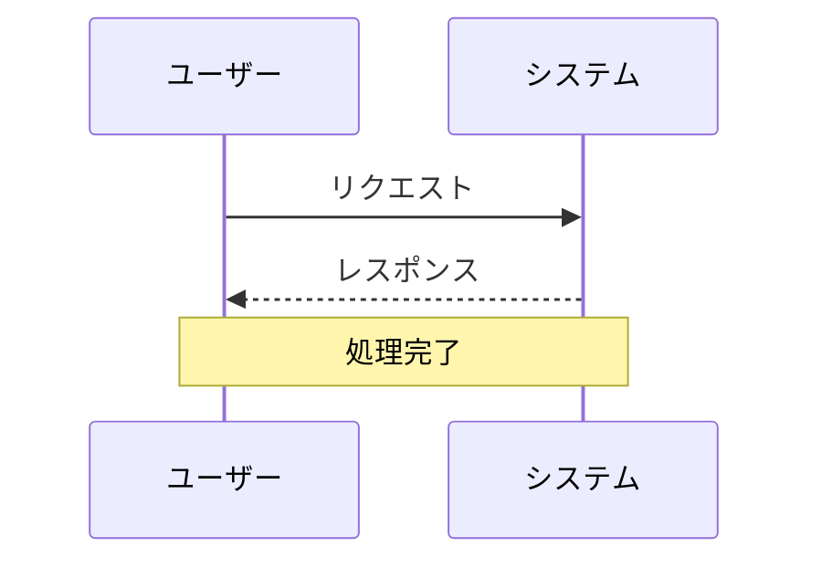

# Claude Code Spec-Driven Development

Kiro-style Spec Driven Development implementation using claude code slash commands, hooks and agents.

## Project Context

### Paths

- Steering: `.kiro/steering/`
- Specs: `.kiro/specs/`
- Commands: `.claude/commands/`

### Steering vs Specification

**Steering** (`.kiro/steering/`) - Guide AI with project-wide rules and context  
**Specs** (`.kiro/specs/`) - Formalize development process for individual features

### Active Specifications

- Check `.kiro/specs/` for active specifications
- Use `/kiro:spec-status [feature-name]` to check progress

## Development Guidelines

- Think in English, but generate responses in Japanese (思考は英語、回答の生成は日本語で行うように)

## Workflow

### Phase 0: Steering (Optional)

`/kiro:steering` - Create/update steering documents
`/kiro:steering-custom` - Create custom steering for specialized contexts

**Note**: Optional for new features or small additions. Can proceed directly to spec-init.

### Phase 1: Specification Creation

1. `/kiro:spec-init [detailed description]` - Initialize spec with detailed project description
2. `/kiro:spec-requirements [feature]` - Generate requirements document
3. `/kiro:spec-design [feature]` - Interactive: "requirements.mdをレビューしましたか？ [y/N]"
4. `/kiro:spec-tasks [feature]` - Interactive: Confirms both requirements and design review

### Phase 2: Progress Tracking

`/kiro:spec-status [feature]` - Check current progress and phases

## Development Rules

1. **Consider steering**: Run `/kiro:steering` before major development (optional for new features)
2. **Follow 3-phase approval workflow**: Requirements → Design → Tasks → Implementation
3. **Approval required**: Each phase requires human review (interactive prompt or manual)
4. **No skipping phases**: Design requires approved requirements; Tasks require approved design
5. **Update task status**: Mark tasks as completed when working on them
6. **Keep steering current**: Run `/kiro:steering` after significant changes
7. **Check spec compliance**: Use `/kiro:spec-status` to verify alignment

## Steering Configuration

### Current Steering Files

Managed by `/kiro:steering` command. Updates here reflect command changes.

### Active Steering Files

- `product.md`: Always included - Product context and business objectives
- `tech.md`: Always included - Technology stack and architectural decisions
- `structure.md`: Always included - File organization and code patterns

### Custom Steering Files

<!-- Added by /kiro:steering-custom command -->
<!-- Format:
- `filename.md`: Mode - Pattern(s) - Description
  Mode: Always|Conditional|Manual
  Pattern: File patterns for Conditional mode
-->

### Inclusion Modes

- **Always**: Loaded in every interaction (default)
- **Conditional**: Loaded for specific file patterns (e.g., `"*.test.js"`)
- **Manual**: Reference with `@filename.md` syntax

---

## Mermaid ER Diagram Editor - 実装計画

### 実装フェーズ

#### Phase 1: 基盤構築

1. **モノレポセットアップ**
   - pnpm workspace設定
   - 共通TypeScript設定（tsconfig.base.json）
   - ESLint/Prettier設定
   - Tailwind CSS設定

2. **型定義作成**（packages/core/src/types/）
   - `ast.ts`: EREntity, ERAttribute, ERRelation, Cardinality, Position, ERDiagram
   - `flow.ts`: EntityNodeData, RelationEdgeData (React Flow用)

3. **パーサー実装**（packages/core/src/parser/）
   - 字句解析（Tokenizer）
   - 構文解析（Parser）
   - Mermaid ER記法 → AST変換

4. **ジェネレーター実装**（packages/core/src/generator/）
   - AST → Mermaid コード生成
   - フォーマットオプション対応

#### Phase 2: GUIコア

1. **Zustandストア**（packages/core/src/store/）
   - ERStore: エンティティ/リレーション/選択状態管理
   - zundo でUndo/Redo対応

2. **React Flowカスタムノード**（packages/core/src/nodes/）
   - EntityNode: テーブル表示（ヘッダー + 属性一覧）

3. **React Flowカスタムエッジ**（packages/core/src/edges/）
   - RelationEdge: カーディナリティマーカー付き接続線

#### Phase 3: プロパティパネル

1. **EntityPanel**: エンティティ編集（名前、属性CRUD、並び替え）
2. **RelationPanel**: リレーション編集（カーディナリティ、ラベル）
3. **Toolbar**: 追加ボタン、Undo/Redo、エクスポート

#### Phase 4: コードエディター & 同期

1. **CodeEditor**: Mermaidコード編集UI
2. **双方向同期**: GUI↔コードのリアルタイム同期（デバウンス付き）
3. **エラー表示**: パースエラーの行ハイライト

#### Phase 5: Webアプリケーション

1. Vite + React Router設定
2. ファイル読み込み/保存（File System Access API）
3. PNG/SVGエクスポート
4. ローカルストレージ保存

#### Phase 6: VSCode拡張

1. CustomTextEditorProvider実装
2. Webview通信
3. ファイル関連付け（_.er.md, _.erd.mmd）

#### Phase 7: テスト

1. Vitest: パーサー/ジェネレーター/ストアのユニットテスト
2. Testing Library: コンポーネントテスト
3. Playwright: E2Eテスト

### パッケージ構成

```
packages/
├── core/     # 共通コア（型、パーサー、ストア、コンポーネント）
├── web/      # Webアプリケーション
└── vscode/   # VSCode拡張
```

---

## Phase 8: GitHub Pages デプロイ & E2E テスト - 実装計画

### 8.1 GitHub Pages デプロイ

#### 目的

- mainブランチへのpush時に自動でGitHub Pagesにデプロイ
- 静的サイトとしてWebアプリケーションを公開

#### 実装内容

1. **Vite ビルド設定の調整**
   - `vite.config.ts` に `base` パスを設定（リポジトリ名に対応）
   - 環境変数で動的に base path を切り替え

2. **GitHub Actions ワークフロー**
   - `.github/workflows/deploy.yml` を作成
   - ステップ:
     1. チェックアウト
     2. Node.js セットアップ
     3. 依存関係インストール
     4. ビルド（core → web）
     5. GitHub Pages へデプロイ

3. **GitHub Pages 設定**
   - Actions からのデプロイを有効化
   - カスタムドメイン設定（オプション）

#### ファイル構成

```
.github/
└── workflows/
    ├── deploy.yml      # Pages デプロイ
    └── ci.yml          # CI（テスト実行）
```

### 8.2 E2E テスト（Playwright）

#### 目的

- ユーザーシナリオに基づいたエンドツーエンドテスト
- 主要機能の自動検証

#### 実装内容

1. **Playwright セットアップ**
   - `packages/web` に Playwright を追加
   - `playwright.config.ts` 設定
   - ブラウザ: Chromium, Firefox, WebKit

2. **E2E テストケース**
   - **基本操作テスト**
     - ホームページの表示
     - エディターページへの遷移
   - **エンティティ操作テスト**
     - エンティティの追加
     - エンティティ名の編集
     - 属性の追加・編集・削除
     - エンティティの削除
   - **リレーション操作テスト**
     - エンティティ間の接続
     - カーディナリティの変更
     - リレーションの削除
   - **コード同期テスト**
     - GUIからの変更がコードに反映
     - コードからの変更がGUIに反映
   - **Undo/Redo テスト**
     - 操作の取り消し
     - 取り消しのやり直し

3. **CI 統合**
   - PRごとにE2Eテストを実行
   - テスト失敗時はマージをブロック

#### ファイル構成

```
packages/web/
├── e2e/
│   ├── home.spec.ts        # ホームページテスト
│   ├── editor.spec.ts      # エディター基本テスト
│   ├── entity.spec.ts      # エンティティ操作テスト
│   ├── relation.spec.ts    # リレーション操作テスト
│   └── sync.spec.ts        # 同期テスト
├── playwright.config.ts
└── package.json            # playwright 追加
```

### 8.3 実装順序

1. Vite ビルド設定の調整
2. GitHub Actions deploy.yml 作成
3. Playwright セットアップ
4. E2E テストケース実装
5. GitHub Actions ci.yml 作成（テスト統合）
6. 動作確認

---

## ローカル動作確認手順

コードを変更した後、CIにプッシュする前に以下のコマンドでローカルで動作確認を行うこと。

### 依存関係のインストール

```bash
npm install
```

### 全チェックの実行（推奨）

以下の順序で全てのチェックを実行する：

```bash
# 1. Lint チェック
npm run lint

# 2. ユニットテスト
npm run test --workspace=@mermaid-er-editor/core

# 3. ビルド（core → web の順で実行される）
npm run build

# 4. E2Eテスト（Chromiumのみで高速化）
npm run test:e2e --workspace=@mermaid-er-editor/web -- --project=chromium
```

### 個別コマンド

| コマンド                                                                    | 説明                               |
| --------------------------------------------------------------------------- | ---------------------------------- |
| `npm run lint`                                                              | ESLint を実行                      |
| `npm run test`                                                              | 全パッケージのユニットテストを実行 |
| `npm run build`                                                             | 全パッケージをビルド               |
| `npm run build:core`                                                        | core パッケージのみビルド          |
| `npm run build:web`                                                         | web パッケージのみビルド           |
| `npm run dev`                                                               | 開発サーバーを起動（ポート1837）   |
| `npm run test:e2e --workspace=@mermaid-er-editor/web`                       | E2Eテストを実行                    |
| `npm run test:e2e --workspace=@mermaid-er-editor/web -- --project=chromium` | E2Eテスト（Chromiumのみ）          |

### E2Eテストの事前準備

初回実行時は Playwright ブラウザをインストールする：

```bash
npx playwright install chromium
```

### 注意事項

- **ポート**: 開発サーバーはポート `1837` を使用
- **ビルド順序**: web パッケージは core パッケージに依存するため、先に core をビルドする必要がある
- **CI環境**: CI では全ブラウザ（Chromium, Firefox, WebKit）でテストが実行される

---

## Phase 9: フローチャート & シーケンス図サポート - 実装計画

### 9.1 概要

現在のER図エディターのアーキテクチャを拡張し、フローチャート（アクティビティ図）とシーケンス図のサポートを追加する。

#### 目標

- Mermaid Flowchart記法のビジュアル編集
- Mermaid Sequence記法のビジュアル編集
- 既存のER図エディターと同様のGUI操作（ドラッグ&ドロップ、プロパティパネル、コード同期）

### 9.2 Mermaid記法サポート範囲

#### フローチャート記法



**サポートするノード形状:**

- `[テキスト]` - 四角形（プロセス）
- `{テキスト}` - ひし形（条件分岐/デシジョン）
- `([テキスト])` - スタジアム型（開始/終了）
- `((テキスト))` - 円形
- `[[テキスト]]` - サブルーチン
- `[(テキスト)]` - シリンダー（データベース）
- `{{テキスト}}` - 六角形

**サポートする矢印:**

- `-->` - 実線矢印
- `---` - 実線
- `-.->` - 点線矢印
- `==>` - 太線矢印
- `-->|テキスト|` - ラベル付き矢印

**サポートする方向:**

- `TD`/`TB` - 上から下
- `BT` - 下から上
- `LR` - 左から右
- `RL` - 右から左

#### シーケンス図記法



**サポートする要素:**

- `participant` / `actor` - 参加者/アクター
- `->>` - 同期メッセージ
- `-->>` - 非同期メッセージ
- `->` - 実線
- `-->` - 点線
- `-x` - 失敗メッセージ
- `Note over/left of/right of` - ノート

### 9.3 アーキテクチャ設計

#### 共通パターン

既存のER図エディターと同じパターンを踏襲:

```
Mermaid Code → Tokenizer → Parser → AST
                                      ↓
                                  Store (Zustand + Zundo)
                                      ↓
                                React Components
                                      ↓
                                 React Flow
                                      ↓
                                  Generator
                                      ↓
                                Mermaid Code
```

#### ファイル構成

```
packages/core/src/
├── types/
│   ├── ast.ts              # (既存) ERDiagram types
│   ├── flowchart.ts        # 【新規】Flowchart types
│   ├── sequence.ts         # 【新規】Sequence types
│   └── index.ts            # 【更新】全型をエクスポート
│
├── parser/
│   ├── tokenizer.ts        # (既存) ER tokenizer
│   ├── parser.ts           # (既存) ER parser
│   ├── flowchartParser.ts  # 【新規】Flowchart parser
│   ├── sequenceParser.ts   # 【新規】Sequence parser
│   └── index.ts            # 【更新】全パーサーをエクスポート
│
├── generator/
│   ├── generator.ts            # (既存) ER generator
│   ├── flowchartGenerator.ts   # 【新規】Flowchart generator
│   ├── sequenceGenerator.ts    # 【新規】Sequence generator
│   └── index.ts                # 【更新】全ジェネレーターをエクスポート
│
├── store/
│   ├── erStore.ts              # (既存) ER store
│   ├── flowchartStore.ts       # 【新規】Flowchart store
│   ├── sequenceStore.ts        # 【新規】Sequence store
│   └── index.ts                # 【更新】全ストアをエクスポート
│
├── nodes/
│   ├── EntityNode.tsx          # (既存) ER entity node
│   ├── flowchart/
│   │   ├── ProcessNode.tsx     # 【新規】四角形ノード
│   │   ├── DecisionNode.tsx    # 【新規】ひし形ノード
│   │   ├── TerminalNode.tsx    # 【新規】開始/終了ノード
│   │   └── index.ts
│   ├── sequence/
│   │   ├── ActorNode.tsx       # 【新規】アクターノード
│   │   └── index.ts
│   └── index.ts
│
├── edges/
│   ├── RelationEdge.tsx        # (既存) ER relation edge
│   ├── flowchart/
│   │   ├── FlowEdge.tsx        # 【新規】フロー矢印
│   │   └── index.ts
│   ├── sequence/
│   │   ├── MessageEdge.tsx     # 【新規】メッセージ矢印
│   │   └── index.ts
│   └── index.ts
│
├── panels/
│   ├── EntityPanel.tsx         # (既存) ER entity panel
│   ├── RelationPanel.tsx       # (既存) ER relation panel
│   ├── SidePanel.tsx           # (既存) Side panel router
│   ├── flowchart/
│   │   ├── FlowchartNodePanel.tsx  # 【新規】ノード編集パネル
│   │   ├── FlowchartEdgePanel.tsx  # 【新規】エッジ編集パネル
│   │   ├── FlowchartSidePanel.tsx  # 【新規】サイドパネル
│   │   └── index.ts
│   ├── sequence/
│   │   ├── ActorPanel.tsx          # 【新規】アクター編集パネル
│   │   ├── MessagePanel.tsx        # 【新規】メッセージ編集パネル
│   │   ├── SequenceSidePanel.tsx   # 【新規】サイドパネル
│   │   └── index.ts
│   └── index.ts
│
├── components/
│   ├── EREditor.tsx            # (既存) ER editor
│   ├── Canvas.tsx              # (既存) ER canvas
│   ├── CodeEditor.tsx          # (既存) Code editor
│   ├── Toolbar.tsx             # (既存) Toolbar
│   ├── flowchart/
│   │   ├── FlowchartEditor.tsx     # 【新規】Flowchart editor
│   │   ├── FlowchartCanvas.tsx     # 【新規】Flowchart canvas
│   │   ├── FlowchartToolbar.tsx    # 【新規】Flowchart toolbar
│   │   └── index.ts
│   ├── sequence/
│   │   ├── SequenceEditor.tsx      # 【新規】Sequence editor
│   │   ├── SequenceCanvas.tsx      # 【新規】Sequence canvas
│   │   ├── SequenceToolbar.tsx     # 【新規】Sequence toolbar
│   │   └── index.ts
│   └── index.ts
│
└── index.ts                    # 【更新】全コンポーネントをエクスポート

packages/web/src/
├── pages/
│   ├── Home.tsx                # 【更新】図タイプ選択を追加
│   ├── EREditorPage.tsx        # (既存) ER editor page
│   ├── FlowchartEditorPage.tsx # 【新規】Flowchart editor page
│   ├── SequenceEditorPage.tsx  # 【新規】Sequence editor page
│   └── index.ts
└── App.tsx                     # 【更新】ルーティング追加
```

### 9.4 型定義詳細

#### flowchart.ts

```typescript
// ノード形状
export type FlowchartNodeShape =
  | 'rectangle' // [テキスト]
  | 'diamond' // {テキスト}
  | 'stadium' // ([テキスト])
  | 'circle' // ((テキスト))
  | 'subroutine' // [[テキスト]]
  | 'cylinder' // [(テキスト)]
  | 'hexagon'; // {{テキスト}}

// 矢印タイプ
export type FlowchartArrowType =
  | 'arrow' // -->
  | 'line' // ---
  | 'dotted-arrow' // -.->
  | 'thick-arrow'; // ==>

// 方向
export type FlowchartDirection = 'TD' | 'TB' | 'BT' | 'LR' | 'RL';

// ノード
export interface FlowchartNode {
  id: string;
  label: string;
  shape: FlowchartNodeShape;
  position: Position;
}

// エッジ
export interface FlowchartEdge {
  id: string;
  sourceId: string;
  targetId: string;
  arrowType: FlowchartArrowType;
  label?: string;
  sourceHandle?: string;
  targetHandle?: string;
}

// ダイアグラム
export interface FlowchartDiagram {
  direction: FlowchartDirection;
  nodes: FlowchartNode[];
  edges: FlowchartEdge[];
}
```

#### sequence.ts

```typescript
// 参加者タイプ
export type ParticipantType = 'participant' | 'actor';

// メッセージタイプ
export type MessageType =
  | 'sync' // ->>
  | 'async' // -->>
  | 'solid' // ->
  | 'dotted' // -->
  | 'cross'; // -x

// 参加者
export interface SequenceParticipant {
  id: string;
  type: ParticipantType;
  name: string;
  alias?: string;
  order: number;
}

// メッセージ
export interface SequenceMessage {
  id: string;
  sourceId: string;
  targetId: string;
  type: MessageType;
  label: string;
  order: number;
}

// ノート
export interface SequenceNote {
  id: string;
  text: string;
  position: 'over' | 'left' | 'right';
  participantIds: string[];
  order: number;
}

// ダイアグラム
export interface SequenceDiagram {
  participants: SequenceParticipant[];
  messages: SequenceMessage[];
  notes: SequenceNote[];
}
```

### 9.5 実装順序

#### Phase 9-A: フローチャートサポート

1. **型定義** (`flowchart.ts`)
2. **パーサー** (`flowchartParser.ts`)
3. **ジェネレーター** (`flowchartGenerator.ts`)
4. **ストア** (`flowchartStore.ts`)
5. **カスタムノード** (`ProcessNode`, `DecisionNode`, `TerminalNode`)
6. **カスタムエッジ** (`FlowEdge`)
7. **パネル** (`FlowchartNodePanel`, `FlowchartEdgePanel`, `FlowchartSidePanel`)
8. **エディターコンポーネント** (`FlowchartEditor`, `FlowchartCanvas`, `FlowchartToolbar`)
9. **ユニットテスト**

#### Phase 9-B: シーケンス図サポート

1. **型定義** (`sequence.ts`)
2. **パーサー** (`sequenceParser.ts`)
3. **ジェネレーター** (`sequenceGenerator.ts`)
4. **ストア** (`sequenceStore.ts`)
5. **カスタムノード** (`ActorNode`)
6. **カスタムエッジ** (`MessageEdge`)
7. **パネル** (`ActorPanel`, `MessagePanel`, `SequenceSidePanel`)
8. **エディターコンポーネント** (`SequenceEditor`, `SequenceCanvas`, `SequenceToolbar`)
9. **ユニットテスト**

#### Phase 9-C: 統合

1. **Webアプリ更新** (ホームページ、ルーティング)
2. **i18n対応** (翻訳キー追加)
3. **E2Eテスト追加**
4. **ドキュメント更新**

### 9.6 UI/UX設計

#### ホームページ更新

- 図タイプ選択カード（ER図、フローチャート、シーケンス図）
- 各タイプの説明とアイコン

#### フローチャートエディター

- ツールバー: ノード形状選択、方向切り替え、Undo/Redo
- キャンバス: ドラッグ&ドロップでノード配置、接続
- サイドパネル: 選択ノード/エッジのプロパティ編集

#### シーケンス図エディター

- ツールバー: 参加者追加、メッセージ追加、Undo/Redo
- キャンバス: タイムライン形式で表示
- サイドパネル: 選択要素のプロパティ編集
